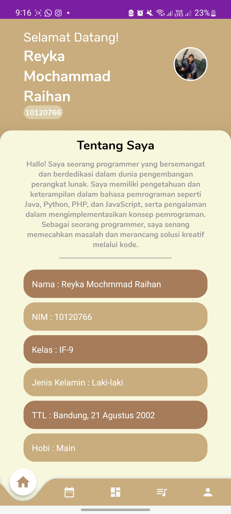
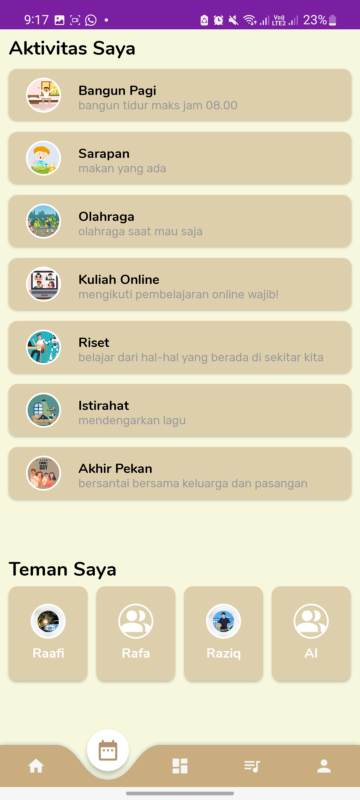
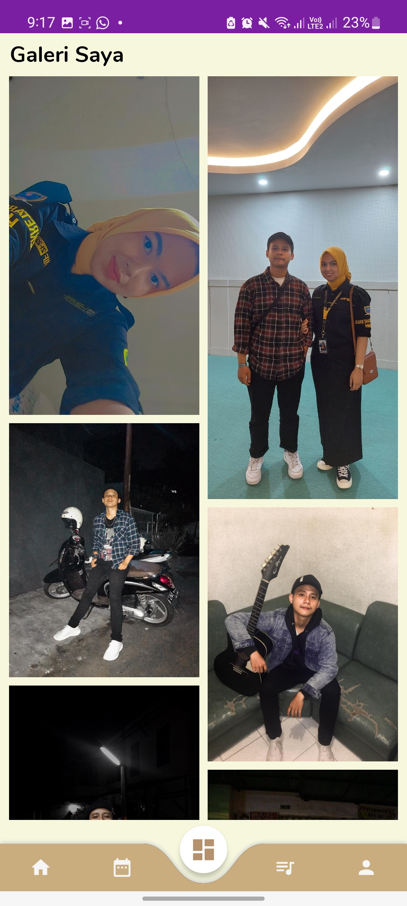
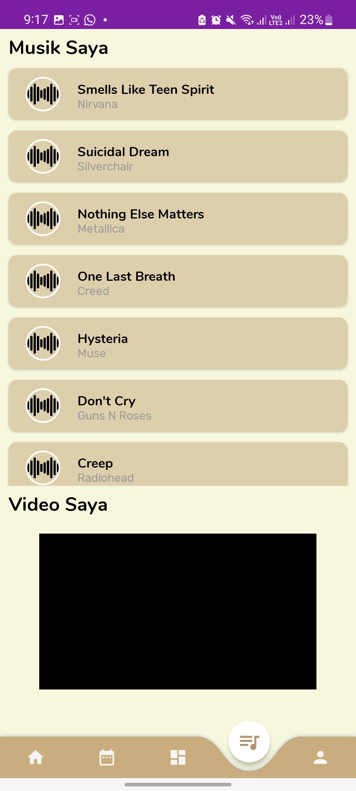
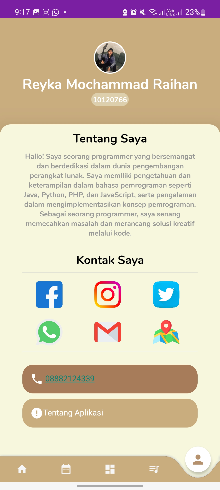

# 🙋‍♂️ Aplikasi Tentang Diri Saya Sendiri


Aplikasi Android tentang diri saya sendiri, dibuat dengan **Android Studio** dan bahasa pemrograman **Java**.  
Aplikasi ini menampilkan informasi mengenai diri saya, aktivitas, teman, galeri, musik, video, dan kontak.

---

## 📸 Tampilan Aplikasi
<table>
  <tr>
    <td></td>
    <td></td>
    <td></td>
  </tr>
  <tr>
    <td></td>
    <td></td>
  </tr>
</table>

---

## ✨ Fitur Utama
- **Splash Screen** → Tampilan awal aplikasi sebelum masuk ke menu utama.  
- **Home** → Menampilkan informasi tentang pribadi.  
- **Aktivitas & Teman** → Menampilkan informasi aktivitas dan teman.  
- **Galeri** → Menampilkan foto-foto.  
- **Musik & Video** → Menampilkan daftar musik dan video favorit.    
- **Profile** → Menampilkan profil pribadi.

---

## 🛠️ Teknologi yang Digunakan
- **Java**
- **Android Studio**

---

## 🚀 Instalasi
1. Clone repositori:
   ```bash
   git clone https://github.com/ReykaMR/MySelfApps.git
2. Buka di Android Studio
3. Jalankan aplikasi di emulator atau perangkat Android.
